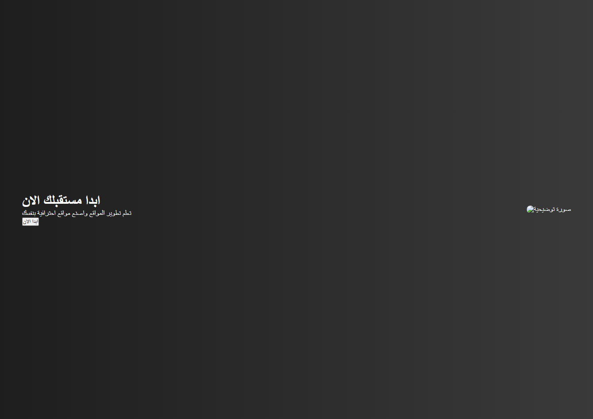

# 🖥️ CSS Project 4 - Landing Section

قسم افتتاحي (Hero Section) احترافي يستخدم في واجهات المواقع لعرض رسالة الموقع بشكل جذاب ومنظم.

---

## 🚀 المميزات

- تصميم احترافي يشبه مواقع الشركات
- تقسيم الشاشة بين النص والصورة
- خلفية متدرجة (Gradient)
- زر تفاعلي بحركة Hover
- استخدام Flexbox لعمل Layout متوازن

---

## 🛠️ التقنيات المستخدمة

- HTML5
- CSS3
- Flexbox
- Gradient Background
- Hover Effects

---

## 🧠 الخصائص التي تم التدريب عليها

- display: flex
- justify-content
- align-items
- height: 100vh
- max-width
- padding
- linear-gradient
- font-size
- margin
- border-radius
- transition
- hover

---

## 📂 هيكل المشروع

css-project-4/
│── index.html
│── style.css
│── screenshot.png
│── README.md

---

## 📷 صورة من المشروع

---

## 🎯 الهدف من المشروع

التدريب على:

- إنشاء Landing Section احترافي
- تقسيم المحتوى باستخدام Flexbox
- استخدام خلفيات متدرجة
- تصميم زر تفاعلي
- تنظيم النص بجانب الصورة بشكل متوازن

---

## ▶️ طريقة التشغيل

1. قم بتحميل المشروع
2. افتح ملف index.html في المتصفح
3. شاهد التصميم والزر التفاعلي

---

## 👨‍💻 المطور

Mohamed Hussin

---

⭐ إذا أعجبك المشروع، لا تنسَ دعمه بنجمة على GitHub